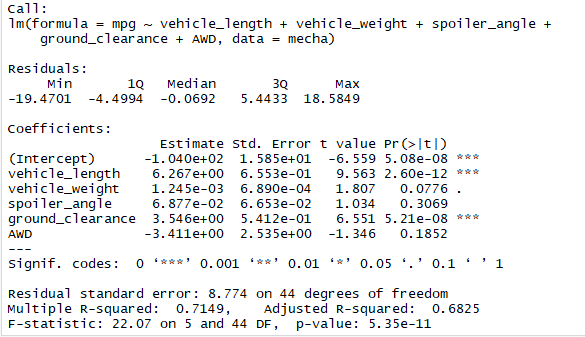

# MechaCar_Statistical_Analysis

## Overview
In this project, we will review the production data for insights that may help the manufacturing team with the new car prototype.

## Linear Regression to Predict MPG
Using all the variables given in the dataset, a linear model is created to predict the outcome of the mileage per gallon.

With this model we get a Multiple R-squared of 0.7149 with a p-value of 5.35e-11. This means that the model explains the 71.49% of the variance with very low chance ofit beingdueto randomness.

* When analysing the Pr(>|t|), we can see that the most significant variables to predict the MPG, are:
    1. vehicle_length, 
    2. ground_clearance
    The rest are not very significant but the still enrich the model.
* The slope is given by wheather we reject the null hypothesis and the estimates for each variable. Since the p-value is under 0.05, we reject the null hypothesis so the slope is indeed not 0.
* This model is not very good, since it explains approximately only 71.5% of the variance.

