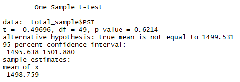

# MechaCar_Statistical_Analysis

## Overview
In this project, we will review the production data for insights that may help the manufacturing team with the new car prototype.

## Linear Regression to Predict MPG
Using all the variables given in the dataset, a linear model is created to predict the outcome of the mileage per gallon.

With this model we get a Multiple R-squared of 0.7149 and a p-value of 5.35e-11. This means that the model explains the 71.49% of the variance with very low chance ofit beingdueto randomness.

* When analysing the Pr(>|t|), we can see that the most significant variables to predict the MPG, are:
    1. vehicle_length, 
    2. ground_clearance
    The rest are not very significant but the still enrich the model.
* The slope is given by whether we reject the null hypothesis and the estimates for each variable. Since the p-value is under 0.05, we reject the null hypothesis so the slope is indeed not 0.
* This model is not very good, since it explains approximately only 71.5% of the variance.

## Summary Statistics on Suspension Coils
The following images show the statistical summaries of the complete and grouped by manufacturing lot suspension coil dataset:
|Total Suspension Summary | Lot Suspension Summary|
:----------------------------:|:----------------------:
 | 
Given the fact that the variance is not allowed to exceed 100 PSI, we can conclude that:
1. The total variance is under the limit, the current manufacturing data meet this design specification.
2. When deepdiving into the manufacturing lots, Lot 2 does not meet this design specification and is pushing the general variance towards the defined limit.

## T-Tests on Suspension Coils
* For the complete dataset T-Test, a sample of 50 observations will be compared to the total mean. In this experiment, the following results are obtained:
                                                                                                       
With a p-value of 0.62, we cannot reject the null hypothesis and we have to say that the PSI across all manufacturing lots is not statistically different from the population mean of 1,500 pounds per square inch.
* When analysing each manufacturing lot by itself with a sample of 50 observations per lot, the following results are obtained:

    |Lot 1                 |Lot2                   |Lot3                   |
    :---------------------:|:---------------------:|:----------------------:
    ||
From the p-values, we can conclude that only Lot 1 is statistically different from the population mean of 1500.

## Study Design: MechaCar vs Competition
As a study design of MechaCar vs Competition, a maintenance cost using multiple two sided two sample t-Tests is proposed.
1. The maintenance cost mean will be tested for every car manufacturer.
2. The null hypothesisis that all maintenance cost means, regardless of the manufacturer are the same.
3. Every manufacturer maintenance cost is compared to MechaCar's maintenance cost using the two sample t-Test, since this test allows an easy way to compare whether the competitor's maintenance cost distributes like MechaCar.
4. The data necessary for this experiment would be two columns, one with the manufacturer's name or code, and another with the observed maintenance cost. The maintenance cost should: 
    * Be numerical and continuos.
    * The sample data was selected randomly from its population data.
    * The input data is considered to be normally distributed.
    * The sample size is reasonably large. Generally speaking, this means that the sample data distribution should be similar to its population data distribution.
    * The variance of the input data should be very similar.